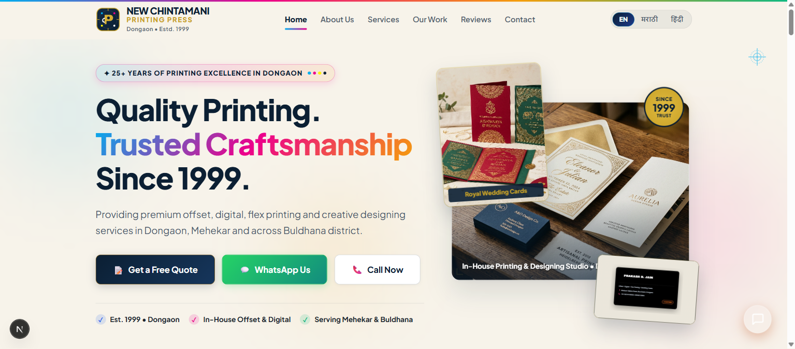

# New Chintamani Printing Press, Dongaon

[](https://nextjs.org/)
[](https://react.dev/)
[](https://www.typescriptlang.org/)
[](https://greensock.com/gsap/)
[](https://github.com/Chinmay-Jain-29/Chintamani_printing_press)

A modern, high-performance, multilingual web platform and administrative content management system for **New Chintamani Printing Press** — a printing and graphic design press serving Dongaon, Mehekar, and Buldhana district since 1999.

---

## 📸 Preview



---

## ✨ Overview

Founded in 1999 by **Mr. Prakash Devendra Jain**, New Chintamani Printing Press has provided offset, digital, and flex printing craftsmanship for over 25 years. This web application offers a digital presence featuring trilingual localization, an interactive service catalog, portfolio gallery, instant quotation request engine, verified customer reviews, and a hardened administrative CMS dashboard.

---

## 🎯 Key Features

### 🌐 Trilingual Localization (EN / MR / HI)
- Instant, client-side language switching between **English**, **Marathi (मराठी)**, and **Hindi (हिंदी)**.
- Localized headings, descriptions, badges, service tags, and contact actions.

### 🎭 Cinematic Animations (GSAP 3)
- Custom intro sequence with printing press registration marks, CMYK aesthetic accents, and smooth curtain transitions.
- Interactive hover cards, counter animations, and entrance effects built using GSAP timelines and ScrollTrigger.

### 🖨️ Comprehensive Printing Services Showcase
- Visiting Cards & Business Stationery
- Royal Wedding Invitations (लग्नपत्रिका / विवाह पत्रिका)
- Flex Banners & Event Hoardings
- Numbered Bill Books & Cash Memos
- Non-Woven Fabric Carry Bags
- Brochures, Pamphlets & Marketing Flyers
- High-Speed Color Xerox, Lamination & Spiral/Hardcover Binding

### 💼 Portfolio & Work Gallery
- Filterable showcase of printed works with high-resolution imagery and specifications.
- Category filters: All, Visiting Cards, Wedding Cards, Flex & Banners, Books & Stationery.

### 📑 Instant Quote Request Engine
- Public modal for customers to submit detailed printing requirements (service type, quantity, custom notes, contact).
- Rate-limited submission endpoint with comprehensive input validation.

### ⭐ Verified Customer Reviews System
- Public testimonial submission modal.
- Administrative approval workflow: submissions remain pending until approved by the administrator before displaying publicly.

### 🛡️ Administrative Content Management System (CMS)
- Secure, password-protected admin portal at `/admin`.
- In-browser management of:
  - **Business Details:** Contact numbers, hours, proprietor bio, social links.
  - **Services:** Add, edit, reorder, or update pricing and specifications.
  - **Portfolio Items:** Upload works, edit tags, and manage showcase items.
  - **Customer Quotes:** View incoming quotation requests with customer details.
  - **Review Moderation:** Approve or reject user-submitted testimonials.
  - **SEO Settings:** Edit meta titles, descriptions, and OpenGraph tags per language.
  - **Security Settings:** Update admin email and password with instant token revocation.

---

## 🛠️ Tech Stack

| Category | Technology |
|---|---|
| **Framework** | [Next.js 15](https://nextjs.org/) (App Router, Turbopack, Server Components) |
| **Frontend Library** | [React 19](https://react.dev/) |
| **Language** | [TypeScript 5](https://www.typescriptlang.org/) |
| **Animations** | [GSAP 3](https://greensock.com/gsap/) (Timeline, ScrollTrigger) |
| **Styling** | Vanilla CSS Design System (`src/app/globals.css`) with curated typography and color tokens |
| **Authentication** | Edge-compatible HMAC SHA-256 JWT tokens with PBKDF2 SHA-512 salted hashing |
| **Storage Engine** | Self-seeding JSON file store with atomic file writes (`src/lib/db.ts`) |
| **Security Layer** | Security headers (CSP, HSTS, X-Frame-Options), sliding-window rate limiting, XSS sanitization |

---

## 📁 Project Structure

```text
Chintamani_printing_press/
├── docs/
│   └── screenshots/
│       └── homepage-preview.png      # Homepage showcase screenshot
├── public/
│   ├── assets/
│   │   ├── hero-printing-showcase.jpg
│   │   ├── owner-prakash-jain.jpg
│   │   └── portfolio/                # SVG/JPG sample showcase graphics
│   └── uploads/
│       └── .gitkeep                  # Tracked directory for user-uploaded media
├── data/
│   └── .gitkeep                      # Tracked directory for operational JSON database
├── src/
│   ├── app/                          # Next.js App Router
│   │   ├── (public)/                 # Public customer routes
│   │   │   ├── page.tsx              # Homepage
│   │   │   ├── aboutus/              # About Us page
│   │   │   ├── services/             # Services catalog
│   │   │   ├── ourwork/              # Portfolio gallery
│   │   │   ├── reviews/              # Customer reviews
│   │   │   ├── getaquote/            # Quote request page
│   │   │   ├── contact/              # Contact information & map
│   │   │   ├── sitemap.ts            # Dynamic XML sitemap
│   │   │   └── robots.ts             # Robots.txt configuration
│   │   ├── admin/                    # Protected CMS portal
│   │   │   ├── page.tsx              # Admin overview dashboard
│   │   │   ├── login/                # Secure admin login
│   │   │   ├── forgot-password/      # PIN-based password recovery
│   │   │   ├── reset-password/       # Password reset confirmation
│   │   │   ├── services/             # Services management
│   │   │   ├── portfolio/            # Portfolio management
│   │   │   ├── quotes/               # Quotation requests inbox
│   │   │   ├── reviews/              # Review approval dashboard
│   │   │   ├── business/             # Business info editor
│   │   │   ├── branding/             # Logo & branding settings
│   │   │   ├── homepage/             # Hero & banner editor
│   │   │   ├── seo/                  # Meta tags & SEO configuration
│   │   │   ├── settings/             # Password & credential update
│   │   │   └── translations/         # Multi-language dictionary editor
│   │   └── api/                      # Backend REST API Routes
│   │       ├── auth/                 # Login, logout, session check, recovery
│   │       ├── admin/                # CRUD endpoints for CMS modules
│   │       ├── content/              # Public content delivery endpoint
│   │       ├── quotes/               # Quote submission endpoint
│   │       └── reviews/              # Review submission endpoint
│   ├── components/                   # Modular React Components
│   │   ├── home/                     # Hero, Stats, Features, Landing Intro
│   │   ├── navigation/               # Navbar, Mobile Menu, Floating Contact Bar
│   │   ├── footer/                   # Process marks, business details, links
│   │   ├── quote/                    # Quote modal & form
│   │   ├── reviews/                  # Review modal & cards
│   │   ├── logo/                     # Brand vector logos
│   │   └── ui/                       # Shared UI buttons, badges, modals
│   ├── context/                      # Global React Context
│   │   └── LanguageContext.tsx       # Trilingual state management (EN / MR / HI)
│   ├── lib/                          # Core utilities & server services
│   │   ├── auth.ts                   # JWT session creation & verification
│   │   ├── db.ts                     # Database driver & default content seeds
│   │   ├── rateLimit.ts              # In-memory sliding rate limiter
│   │   ├── schema.ts                 # TypeScript interfaces & data models
│   │   └── security.ts               # Input sanitizers & response formatters
│   └── middleware.ts                 # Next.js Edge Middleware for route protection
├── .env.example                      # Template for environment configuration
├── .gitignore                        # Git exclusion rules
├── next.config.mjs                   # Next.js configuration & security headers
├── package.json                      # Project dependencies and npm scripts
├── tsconfig.json                     # TypeScript compiler configuration
└── README.md                         # Project documentation
```

---

## 🚀 Getting Started

### Prerequisites
- **Node.js**: v18.18.0 or higher (v20+ recommended)
- **npm**: v9.0.0 or higher (or pnpm / yarn)

### Installation

1. **Clone the repository:**
   ```bash
   git clone https://github.com/Chinmay-Jain-29/Chintamani_printing_press.git
   cd Chintamani_printing_press
   ```

2. **Install dependencies:**
   ```bash
   npm install
   ```

3. **Configure environment variables:**
   Copy `.env.example` to create your local `.env.local`:
   ```bash
   cp .env.example .env.local
   ```
   Configure your `ADMIN_SESSION_SECRET` (32+ character random string) and your Supabase PostgreSQL credentials (`NEXT_PUBLIC_SUPABASE_URL`, `NEXT_PUBLIC_SUPABASE_ANON_KEY`, `SUPABASE_SERVICE_ROLE_KEY`).

4. **Apply Supabase Database Migrations & Seed Data:**
   - Execute `supabase/migrations/001_initial_schema.sql` in your Supabase SQL Editor.
   - Run the automated migration script to sync existing catalog items and quotes:
   ```bash
   node scripts/migrate-to-supabase.mjs
   ```
   See [`docs/supabase-setup.md`](docs/supabase-setup.md) for full step-by-step instructions.

5. **Run the development server:**
   ```bash
   npm run dev
   ```
   Open [http://localhost:3000](http://localhost:3000) in your browser.

6. **Build for production:**
   ```bash
   npm run build
   npm run start
   ```

---

## 🗄️ Database Architecture (Supabase PostgreSQL)

Data persistence is powered by **Supabase PostgreSQL** with Row Level Security (RLS):
- **Quotes Inbox (`quotes`):** Customer inquiries persist permanently across Vercel deployments, cold starts, and function instances.
- **Service Catalog (`services`):** Dynamic trilingual printing services with sort order, featured flags, and custom icons.
- **Portfolio Showcase (`portfolio`):** Filterable recent works with high-res photography and specifications.
- **Customer Reviews (`reviews`):** Public reviews with strict server-side administrative moderation.
- **Site Settings (`site_settings`):** Business contact details, branding logos, homepage hero configuration, and SEO metadata.
- **Multilingual Content (`translations`):** Trilingual UI dictionaries (English, Marathi, Hindi).
- **Storage Bucket (`chintamani_uploads`):** Cloud-hosted images for uploaded print samples and banners.

---

## 🔐 Security & Hardening Highlights

- **Session Protection:** Administrative sessions use HTTP-only, SameSite=Lax, encrypted JWT cookies.
- **Zero Frontend Credential Exposure:** Login fields default to empty with no prefilled values or developer hints in client code or production bundles.
- **Rate Limiting:** Public endpoints (`/api/quotes`, `/api/reviews`, `/api/auth/login`) are protected with sliding-window IP rate limiting.
- **Input Sanitization:** User inputs undergo string stripping, HTML entity encoding, and strict regex validation before processing.
- **Security Headers:** Configured via `next.config.mjs` and `src/middleware.ts` including `Content-Security-Policy`, `X-Frame-Options: DENY`, `X-Content-Type-Options: nosniff`, `Referrer-Policy`, and `Strict-Transport-Security`.
- **Protected File Storage:** The operational database (`data/store.json`) and uploaded files are isolated and excluded from version control.

---

## 🏪 About the Business

| Detail | Information |
|---|---|
| **Business Name** | NEW CHINTAMANI PRINTING PRESS |
| **Founder & Proprietor** | Mr. Prakash Devendra Jain |
| **Established** | 1999 (25+ Years of Excellence) |
| **Address** | Shrikant Talkies Road, Bus Stand, Mehekar, Buldhana – 443303, Maharashtra, India |
| **Working Hours** | 8:00 AM – 8:30 PM (All Days) |
| **Phone & Inquiries** | [+91 9421396905](tel:9421396905) / [+91 9834853851](tel:9834853851) |
| **WhatsApp** | [+91 9421396905](https://wa.me/919421396905) |
| **Email** | chintamanidongaon@gmail.com |

---

## 🤝 Contributing

1. Fork the repository.
2. Create your feature branch (`git checkout -b feature/improvement`).
3. Commit your changes (`git commit -m 'Add new enhancement'`).
4. Push to the branch (`git push origin feature/improvement`).
5. Open a Pull Request.

---

## 📄 License

This project is proprietary and confidential to **New Chintamani Printing Press**. All rights reserved.
